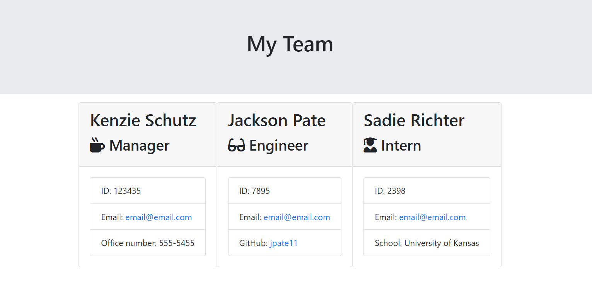

# Employee Directory Generator

## Table of Contents

- [About](#About)
- [Installation](#installation)
- [Usage](#usage)
- [Tests](#tests)
- [Demo](#demo)
- [Developer](#developer)

## About

When dealing with software development, your team may want to generate a webpage that displays my team's basic info
so that I have quick access to each employee's name, role, email, contact info, github profile, ect.

This software uses node to generate a series of questions for the user to create contact cards for each employee which generate on an HTML page called team.HTML

## Installation

This software requires npm installation as well as visual studio code or a similar program.

## Usage

To use this software you need visual studio code (or a similar program), NPM and a github account.  
 Once NPM files are installed with your code, run node index.js on the command bar. You will be prompted with a series of questions about the content of your team.HTML. Once you've answered all of the questions the HTML file will automatically generate which you can use for any team project.

## Tests

TDD and jest were used to build this software. Tests can be found in the test directory.

## Demo

[Server Side Demo](https://youtu.be/WuKnegrWKgI)

  

## Developer

      
 
   Mackenzie Schutz <a href="https://github.com/knzmck" target="_blank">@Knzmck</a>

